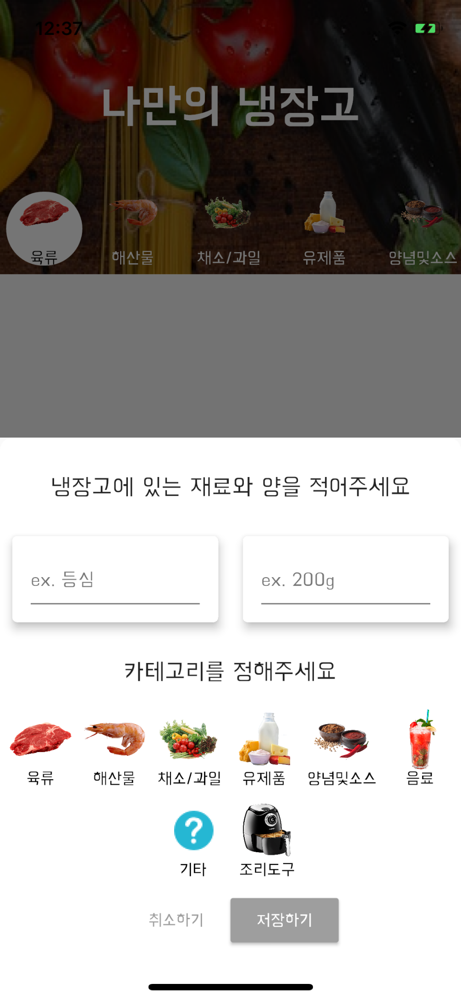
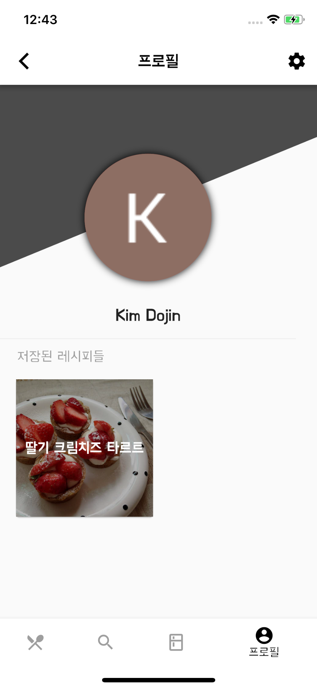
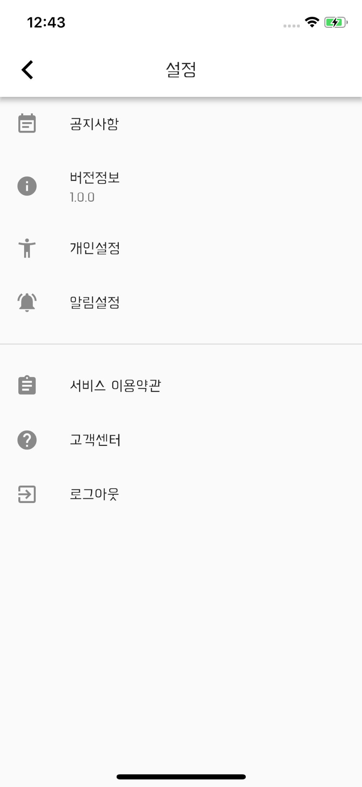

#Cookday

Recipe application developed with Flutter - Hybrid Mobile application framework
Flutter 프레임워크를 사용한 음식 레시피 어플리케이션

## 페이지 소개

### 메인 페이지 (Home)
> 메인 페이지

<div align="center">
</div>


### 디테일 페이지 (Detail Page)
> 디테일 페이지

<div align="center">
</div>


### 검색 페이지 (Search Page)
> 검색 페이지

<div align="center">
</div>


### 재료 추가 페이지 (Ingredient add page)
> 재료 추가 페이지

<div align="center">
</div>


### 재료 추가된 페이지 (Ingredient added page)
> 재료 추가된 페이지

<div align="center">
</div>


### 마이 페이지 (My page)
> 마이 페이지

<div align="center">
</div>


### 설정 페이지(Setting)
> 설정 페이지

<div align="center">
</div>


For help getting started with Flutter, view our online
[documentation](https://flutter.io/).


## License
Copyright (C) 2018-present,  CookDayHenry

```
Permission is hereby granted, free of charge, to any person obtaining a copy of this software and associated documentation files (the "Software"), to deal in the Software without restriction, including without limitation the rights to use, copy, modify, merge, publish, distribute, sublicense, and/or sell copies of the Software, and to permit persons to whom the Software is furnished to do so, subject to the following conditions:

The above copyright notice and this permission notice shall be included in all copies or substantial portions of the Software.

THE SOFTWARE IS PROVIDED "AS IS", WITHOUT WARRANTY OF ANY KIND, EXPRESS OR IMPLIED, INCLUDING BUT NOT LIMITED TO THE WARRANTIES OF MERCHANTABILITY, FITNESS FOR A PARTICULAR PURPOSE AND NONINFRINGEMENT. IN NO EVENT SHALL THE AUTHORS OR COPYRIGHT HOLDERS BE LIABLE FOR ANY CLAIM, DAMAGES OR OTHER LIABILITY, WHETHER IN AN ACTION OF CONTRACT, TORT OR OTHERWISE, ARISING FROM, OUT OF OR IN CONNECTION WITH THE SOFTWARE OR THE USE OR OTHER DEALINGS IN THE SOFTWARE.


